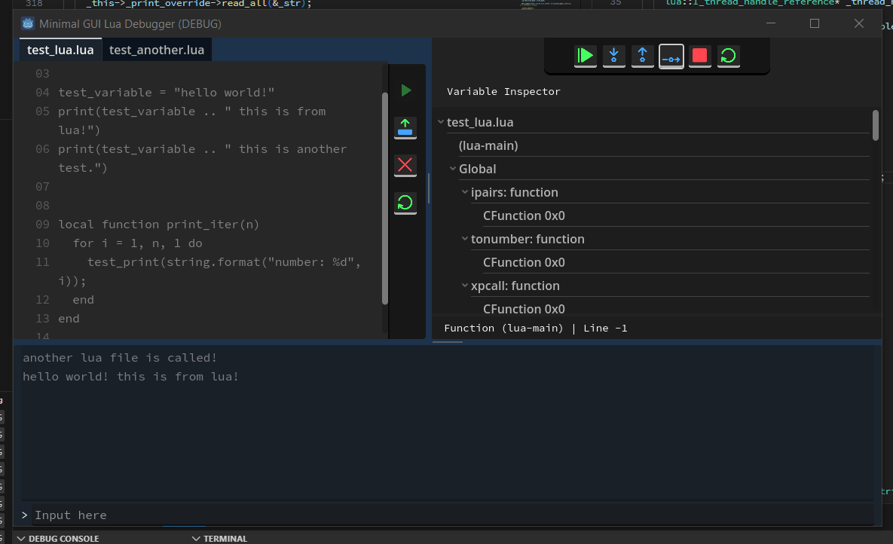
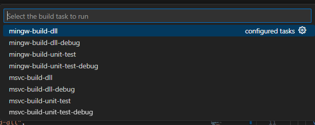

[](https://ko-fi.com/X8X0175H9C)

# Lua Debug API

A Lua Library extension using C++ as the icing of Lua's cake.
Current Lua code version: 5.3

**NOTE**: Using this API with another version of Lua API will introduce undefined behaviours.

This API built only for Windows as of now, there are plans for Linux port, since I'm planning to switch to Linux.

### Things to consider when using the API:

Objects created by the API, its lifetime should be managed based on the lifetime of the Lua State or the API module.

If using custom memory management for the API, make sure that every API objects lifetime should be based on the memory management lifetime (if provided by C++ class).

  
## Why I Created This

While playing Minecraft with OpenComputers mod, I was curious how some programming language can be integrated into an Application. While my knowledge previously was only connection between C++ programs using Sockets or Pipes, I feel like only using that, does not have enough control over the user program. So I decided to play around with Lua internally. Thanks to Lua's Open Source nature, I can freely observe and modify their source code to fit my needs.

## See Also
### [Lua Debugger](https://github.com/NewbySlime/Lua-Debugger-GUI)


## Example
### Compilation Context
This object contains interfaces of Lua functions stored in Library. Use this object to use Library functions
```
#include "../Src/luaapi_compilation_context.h"

const lua::api::compilation_context* _cc = cpplua_get_api_compilation_context();
/* do stuff here */
```
 
### Runtime Handler
Use this object to run Lua program
```
#include "../Src/luaapi_runtime.h"

I_runtime_handler* _rh = _cc->api_runtime->create_runtime_handler("lua_src.lua", true);
_rh->run_code(); // run the code
```

### Lua Core
Object storing both Lua State and Compilation Context, following example will try to set a global variable
```
const lua::api::core _lc = _rh->get_lua_core_copy();

number_var _global_number = 128;
_lc->context->api_varutil->set_global(_lc->istate, "nvar", &_global_number);
```

### Variants
Variants are objects storing Lua data/variables into C++ variables
```
number_var _num1 = 10;
number_var _num2 = 2;
number_var _num3 = _num1 * _num2;
// num3 is now 20

string_var _numstr = _num3.to_string();
// numstr is now "20"
```

Additional Info - Src/README.md
Testing Program - TestSrc/unit_test.cpp


## Building and Running
Use makefile with flags used in the following code (make sure the working directory is right, in Lua-Debug-API)
```
mingw32-make f_use_mingw proc_compile
```
If the preferred compiler is MSVC;
```
vsdevcmd.bat && mingw32-make f_use_msvc proc_compile
```

If needed to compile in Debug mode add flag,
```
f_as_debug

# Example
mingw32-make f_use_mingw f_as_debug proc_compile
```

Alternatively, use configuration presets I use for VSCode (in tasks.json)



After building, two files are created, static compilation file and DLL file. You only have to use static file to integrate it with your program. The DLL can be dynamically linked with C++ linker or can be used with OS API functions (ex. LoadLibrary in Windows).


## Contributing
Any contributions are appreciated, make sure to state your problems or features. You might also want to expect on some long delay in merging since I'm still in University.

### NOTE for changing Lua version:

Since there are some modifications to the original Lua code for this C++ API, things to consider when changing to new Lua code/version;

- Changes to lua_lock and lua_unlock to use C++ API multithreading code for synchronization.

- Minor changes to Lua API functions (some are excluded, functions that uses two stacks like transferring data between state's stack (lua_xmove)) to use macro for swapping state to thread dependent state (removing possibility for multiple threads accessing one stack).